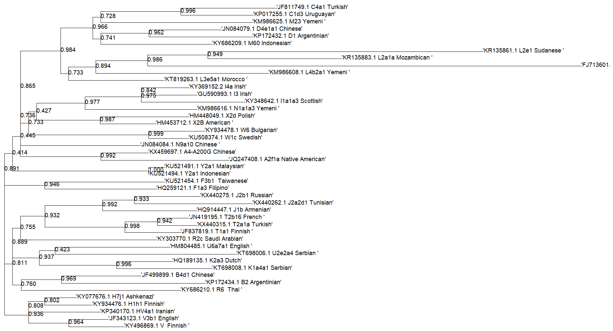
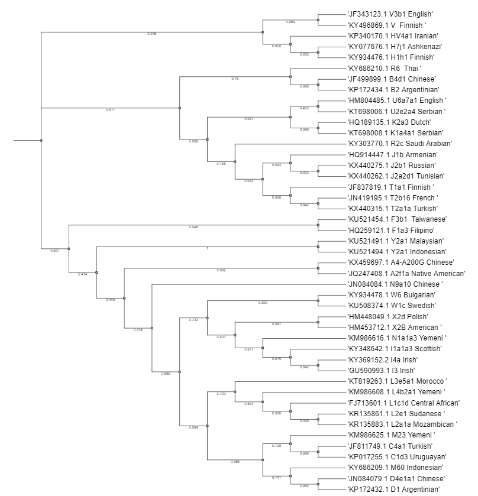
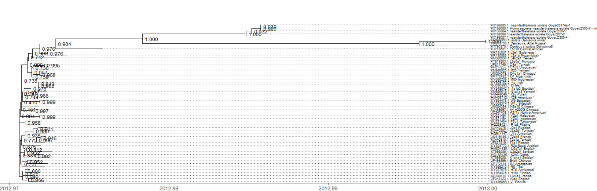

## Where Do We Come From?
### Шаг 1
Создание рабочего окружения
```
conda create -n philo
conda install bioconda::mafft
conda install bioconda::fasttree
conda install bioconda::iqtree
```
Объединение исходных файлов и выравнивание
```
cat *.fasta* > Human.fasta
mafft --auto Human_all_alg.fasta > human_ali.fasta
```
Создание дерева 
```
FastTree -gtr -boot 1000 -quote -nt human_ali.fasta > tree_all.newick
```
Визуализация полученного дерева с помощью R studio


Визуализация дерева на платформе https://itol.embl.de/


Вывод: Среди представленных здесь образцов, раньше всего отделились люди из средней Африки, Судана и Мозамбика. Остальные группируются по гаплогруппам, потому что миграционные процесы способствуют перемещению людей по всем континентам. 
### Шаг 2
Каков возраст митохондриальной Евы?
Для ответа на этот вопрос сраниваем последовательности с FJ713601 Central African, выбираем большее значение. 
 

Наибольшее значение - 106 мутаций, если использовать константу -4500 лет на одну мутацию - (106*4500)/2=238 500 лет нашей Еве
## Шаг 3
Добавляем неандертальцев и денисевцев для укоренения дерева 
```
cat Denisova1.fasta Denisova2.fasta Denisova3.fasta Neanderthal1.fasta Neanderthal2.fasta Neanderthal3.fasta Neanderthal4.fasta  Neanderthal5.fasta Human.fasta > Hum_neo_den.fasta
mafft --auto Hum_neo_den.fasta > all_alg.fasta
FastTree -gtr -boot 1000 -quote -nt all_alg.fasta > tree.newick
```

R img




Определим возраст древних популяций, опредяляем количество мутаций между образцом FJ713601 Central African и древними людьми
KX198087.1 : 206 
KX198086.1 : 221 
KX198085.1 : 220 
KX198084.1 : 226 
KX198088.1 : 212 
FN673705.1 : 397 
FR695060.1 : 397 
KT780370.1 : 374
Неандертальцы: (~217*4500)/2 = 488 250 лет
Денисовцы: (~389*4500)/2 = 876 000 лет

Вывод:  
Денисовский человек, живший почти 900 тысяч лет назад, и неандерталец, который существовал около 500 тысяч лет, оставили значительный след в геноме современного человека. Несмотря на общие черты, эти древние виды остаются далеко от нас не только по образу жизни и развитию, так с точки зрения ДНК. Возраст митохондриальной Евы — нашей гипотетической праматери,  — оценивается примерно в 250 тысяч лет. 