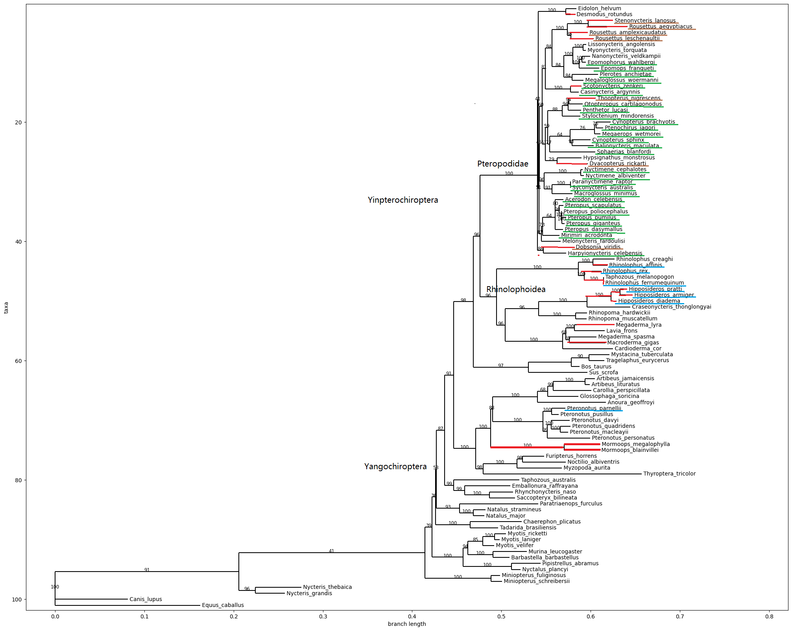
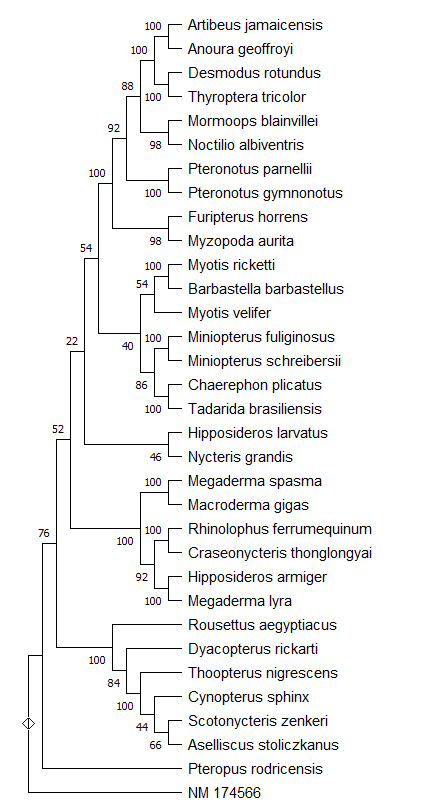
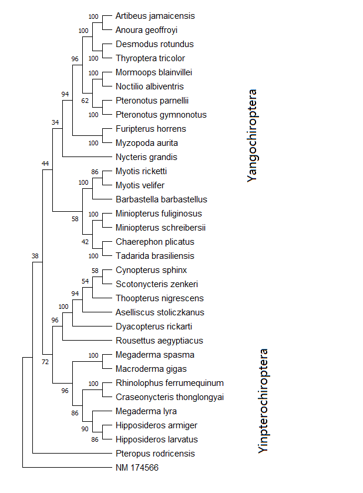

# As Blind as a Bat? Opsin Phylogenetics Illuminates the Evolution of Color Vision in Bats

Презентация: https://docs.google.com/presentation/d/1GzOZdQv8hjvgzmZSvABmju_QLyKAbjrMe9GssHRY_Ug/edit?usp=sharing

[Код](https://colab.research.google.com/drive/1_VJhOgcM_Sdm-Bm0QVt6hxue1DdDRksx?usp=sharing)
## Вступление 

Летучие мыши обладают уникальной адаптацией среди млекопитающих- они успешный ночные животные, которые  могут летать, занимают разнообразные экологические ниши по всему миру и используют гортанную эхолокацию для охоты и ориентации в пространстве. 
Изучив эволюцию и функциональность зрительных пигментов можно сделать предположение о том, как зрение способствовало адаптации летучих мышей к различным экологическим нишам.
На данный момент известно, что в колбочках, отвечающих за цветное зрение есть два типа молекул опсина:

SWS1 - коротковолновый опсин, отвечает за восприятие света в сине -фиолетовом спектре, с длинной волны  ∼360 до 440 нм
MWS/LWS - средне- и длинноволновый опсин, отвечает за чувствительность к зелёно-красноме спектру с волной ∼536 до 560 нм

###  SWS1 

Из ncbi был собран датасет, который содержит последовательности "short-wavelength sensitive opsin 1" для 96 видов летучих мышей и добавлено еще 5 видов аутгруппы для укоренения дерева.
все последовательности были выравнены с использованием mafft и с помощью iqtree получено филогенетическое дерево в формате newick. Деревья имеют 

Best-fit model according to BIC: SYM+R3. ML (Maximum Likelihood)

Виды, использующие эхолокацию HDC - синим цветом
Красные ветви соответствуют кончикам, в которых ген SWS1 нефункционален Pteropodidae выделены зеленым цветом
Коричневый цвет используется для обозначения таксонов, обитающих в пещерах

Вывод: Предыдущие исследования предполагали сенсорный компромисс между функциональностью опсина SWS1 и эхолокацией HDC, однако, впервые, анализы показывают, что опсин SWS1 претерпел псевдогенизацию в более эхолокирующих линиях летучих мышей и не ограничивается эхолокаторами HDC. Все эхолокаторы HDC (семейства Rhinolophidae Hipposideridae и Rhinonycteridae) показали мутации потери функции, однако это не наблюдалось у единственного другого вида летучих мышей, способного к эхолокации HDC, Pteronotus parnellii.

### MWS/LWS 
Для данного датасета отобраны гены "long-wavelength sensitive opsin 1" для 32 видов и 1 вид аутгруппы

в данном случае использовалась mega для построения дерева по методу ближайших соседей (Neighbor-Joining, NJ)

NJ:

Maximum likehood tree

Деревья были построены для того, чтобы показать эволюционные связи между видами, у которых есть гены MWS и LWS опсинов. На основе такого дерево довольно просто анализировать данные ( в статье, например, представлен анализ предполагаемый анализ длин волн )